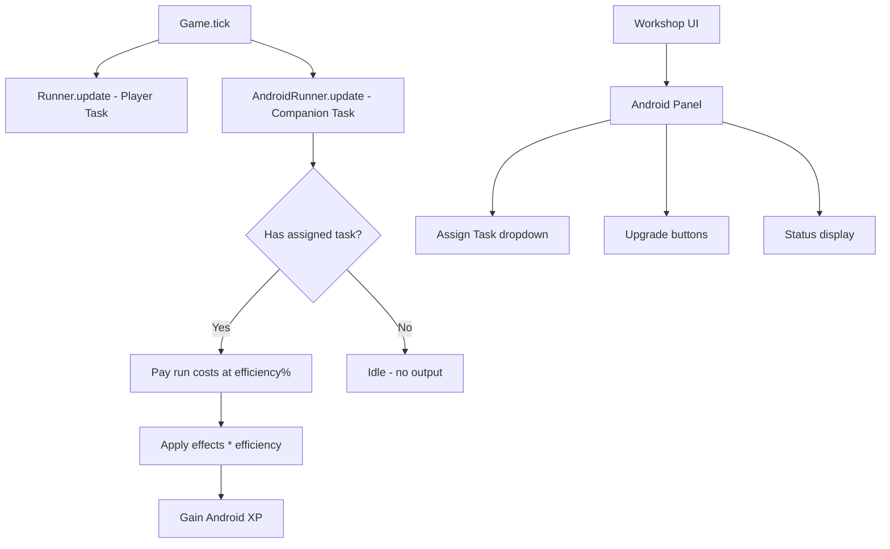

# Android Companion System — Implementation Plan

## Goal

Implement the Android Companion from the Design Archaeology (§2D). A buildable, programmable helper unit that automates scrapyard tasks. Starts as a **hands-on, programmable** system and gradually evolves into **true idle automation** through prestige upgrades.

---

## User Review Required

> [!IMPORTANT]
> **Discovery Trigger:** The document says the Android is "found during scrapyard foraging." This plan assumes it drops from the existing `search_parts` task at ~15% chance once the player has the Garage (`g.garagem>0`). Does this feel right, or should it be a guaranteed milestone reward?

> [!IMPORTANT]
> **Task Subset:** The Android can only run tasks from a curated list (not all tasks). Initially: basic scavenging tasks. Which tasks should be available at each upgrade tier?

> [!IMPORTANT]
> **Naming:** The Design Archaeology calls it "Android." Should we give it a proper in-universe name (e.g., "KUMA Unit", "Companion Drone", "Salvage Bot") or keep it generic?

---

## Architecture Overview



The Android runs as a **second Runner** — a parallel task executor with reduced efficiency that improves through upgrades and prestige.

---

## Proposed Changes

### Data Layer

---

#### [NEW] [android.json](file:///c:/Users/nicol/dyad-apps/MechaScrapyard/data/mecha/android.json)

Android definition, upgrade tiers, and assignable task list.

```json
{
  "id": "android_companion",
  "name": "Salvage Unit KM-03",
  "desc": "A battered helper bot found buried in the scrapyard. Programmable for basic tasks.",
  "flavor": "Someone loved this thing once. The scratches spell out a name you can't quite read.",
  "type": "companion",
  "locked": true,

  "stats": {
    "efficiency": 0.25,
    "energyCostMult": 1.5,
    "maxTasks": 1
  },

  "allowedTasks": [
    "scavenge_scrap"
  ],

  "upgrades": [
    {
      "id": "android_t2",
      "name": "Motor Calibration",
      "desc": "Recalibrate servomotors. +10% efficiency, unlocks industrial scavenging.",
      "cost": { "parts": 5, "scrap": 50 },
      "effect": { "efficiency": 0.35 },
      "unlockTasks": ["scavenge_industrial", "scavenge_residential"]
    },
    {
      "id": "android_t3",
      "name": "Neural Patch v1",
      "desc": "Install a basic decision matrix. +15% efficiency, unlocks tech scavenging.",
      "cost": { "electronic_scrap": 30, "nano_infra": 5 },
      "effect": { "efficiency": 0.50 },
      "unlockTasks": ["scavenge_tech_district"]
    },
    {
      "id": "android_t4",
      "name": "Autonomy Core",
      "desc": "Full autonomous operation. Runs without player energy drain.",
      "cost": { "quantum_circuits": 5, "fusion_cells": 3 },
      "effect": { "efficiency": 0.75, "energyCostMult": 0 },
      "unlockTasks": ["search_parts", "salvage_mecha_parts"]
    }
  ],

  "prestigeUpgrades": [
    {
      "id": "android_prestige_multitask",
      "name": "Parallel Processing",
      "desc": "Android can run 2 tasks simultaneously.",
      "cost": { "glory": 15 },
      "effect": { "maxTasks": 2 }
    },
    {
      "id": "android_prestige_idle",
      "name": "True Idle Protocol",
      "desc": "Android generates resources even when the game is closed (offline progress).",
      "cost": { "glory": 30 },
      "effect": { "offlineMode": true }
    }
  ]
}
```

---

#### [MODIFY] [tasks.json](file:///c:/Users/nicol/dyad-apps/MechaScrapyard/data/mecha/tasks.json)

Add `"androidAllowed": true` flag to scavenging tasks that the companion can execute. No structural change — just a boolean tag.

---

### Engine Layer

---

#### [NEW] [androidRunner.js](file:///c:/Users/nicol/dyad-apps/MechaScrapyard/src/modules/androidRunner.js)

A lightweight runner that mirrors [Runner.js](file:///c:/Users/nicol/dyad-apps/MechaScrapyard/src/modules/combatRunner.js) but:
- Executes at `efficiency%` of normal output
- Costs `energyCostMult` times normal energy (or zero at T4)
- Only runs tasks from `allowedTasks` list
- Gains Android XP per tick (for future progression)
- Serializes/deserializes its own state

Key methods:
| Method | Purpose |
|--------|---------|
| `assignTask(taskId)` | Set the Android's current task |
| `removeTask()` | Stop the Android |
| [update(dt)](file:///c:/Users/nicol/dyad-apps/MechaScrapyard/src/modules/runner.js#64-138) | Tick — same pattern as `Runner.update()` but scaled |
| `upgradeAndroid(upgradeId)` | Apply an upgrade tier |
| [toJSON() / fromJSON()](file:///c:/Users/nicol/dyad-apps/MechaScrapyard/src/gameState.js#261-292) | Persistence |

---

#### [MODIFY] [game.js](file:///c:/Users/nicol/dyad-apps/MechaScrapyard/src/game.js)

- Import `AndroidRunner`
- Initialize it in [init()](file:///c:/Users/nicol/dyad-apps/MechaScrapyard/src/game.js#74-138) alongside the player Runner
- Call `androidRunner.update(dt)` inside [tick()](file:///c:/Users/nicol/dyad-apps/MechaScrapyard/src/game.js#165-223)
- Add `upgradeAndroid(id)` and `assignAndroidTask(taskId)` methods
- Add a milestone for discovering the Android (tied to `search_parts` loot table)
- Serialize/deserialize AndroidRunner state in [serialize()](file:///c:/Users/nicol/dyad-apps/MechaScrapyard/src/game.js#342-356) / [fromJSON()](file:///c:/Users/nicol/dyad-apps/MechaScrapyard/src/modules/combatRunner.js#895-913)

---

#### [MODIFY] [gameState.js](file:///c:/Users/nicol/dyad-apps/MechaScrapyard/src/gameState.js)

- Register the `android_companion` item during data loading
- Expose `android_companion` to the `g.` namespace for `require` expressions

---

### UI Layer

---

#### [MODIFY] [TerminalUI.vue](file:///c:/Users/nicol/dyad-apps/MechaScrapyard/src/ui/TerminalUI.vue)

Add an **Android Panel** inside the **WORKSHOP** tab (below the existing blueprint cards):

```
> COMPANION: KM-03
┌─────────────────────────────────┐
│  STATUS: ACTIVE                 │
│  TASK: Scavenge Scrap           │
│  EFFICIENCY: 25%                │
│  OUTPUT: ⚙ +0.15/s             │
│                                 │
│  [ ASSIGN TASK ▼ ]              │
│  [ UPGRADE: Motor Calibration ] │
└─────────────────────────────────┘
```

Components:
- Task assignment dropdown (filtered by `allowedTasks`)
- Real-time output display (resource/s × efficiency)
- Upgrade button with cost tooltip
- ASCII progress indicator

---

### Narrative Layer

---

#### [MODIFY] [game.js milestoneCheck()](file:///c:/Users/nicol/dyad-apps/MechaScrapyard/src/game.js)

Add milestone dialogues:
- **Discovery:** Grandpa dialogue when found → "Your father built this thing. Said it was his 'apprentice.'"
- **First Upgrade:** System message → "KM-03 MOTOR CALIBRATION COMPLETE. Efficiency increased."
- **Autonomy Core:** System message → "KM-03 is now fully autonomous. It doesn't need you anymore... but it stays."

---

## Verification Plan

### Automated Tests
- Verify `AndroidRunner.update()` produces resources at `efficiency%` rate
- Verify task assignment respects `allowedTasks` filter
- Verify upgrades correctly modify efficiency and unlock tasks
- Verify serialization round-trip (save → load → state matches)

### Manual Verification
- Open Workshop tab → confirm Android panel renders
- Assign a task → confirm resource output appears in Resource Monitor
- Buy an upgrade → confirm efficiency increases and new tasks unlock
- Save/reload → confirm Android state persists
- Run the browser subagent to visually verify the panel

---

## Implementation Order

1. **Data:** Create `android.json`, add `androidAllowed` flags to [tasks.json](file:///c:/Users/nicol/dyad-apps/MechaScrapyard/data/mecha/tasks.json)
2. **Engine:** Create `AndroidRunner.js`, wire into `Game.tick()`
3. **State:** Register companion in [gameState.js](file:///c:/Users/nicol/dyad-apps/MechaScrapyard/src/gameState.js), add serialization
4. **UI:** Add Android panel to Workshop tab in [TerminalUI.vue](file:///c:/Users/nicol/dyad-apps/MechaScrapyard/src/ui/TerminalUI.vue)
5. **Narrative:** Add milestone dialogues
6. **Verify:** Browser test + save/load round-trip
